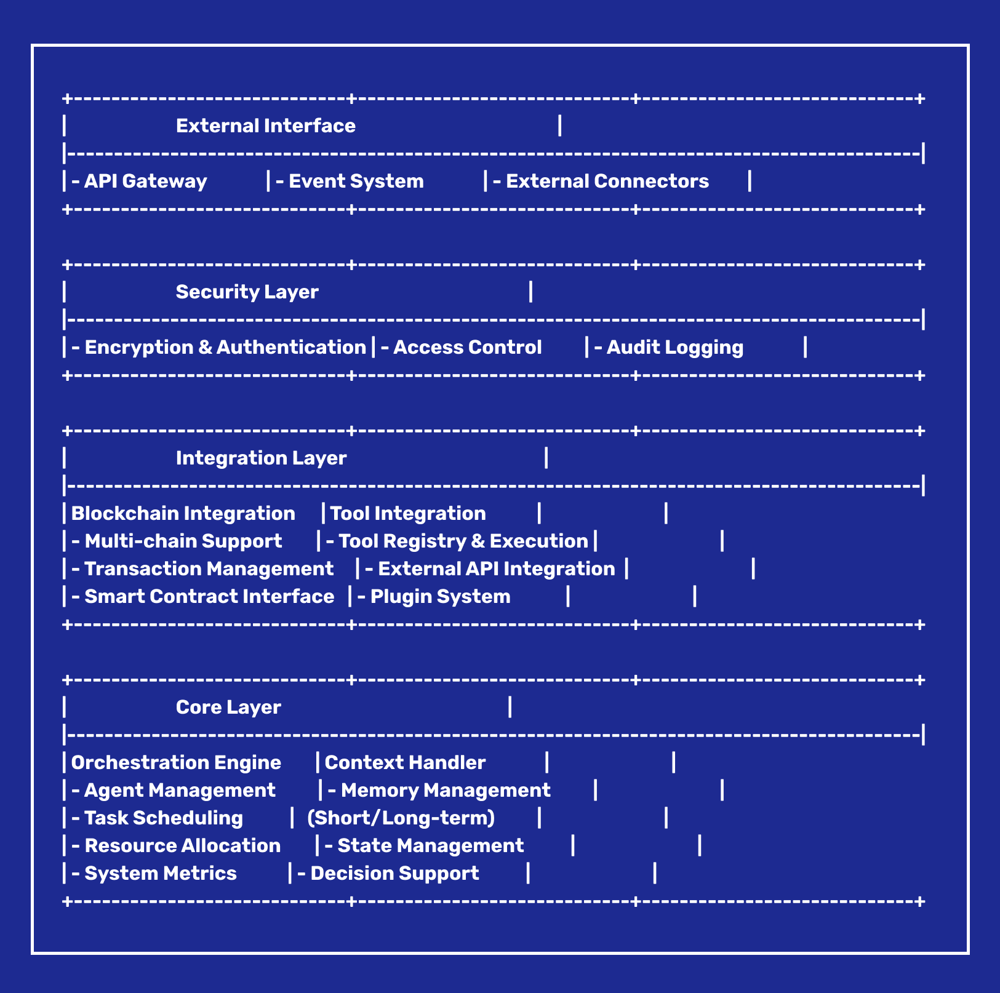

# O.R.B.I.T.

<div align="center">
  
  <h3>Orchestrated Responsive Business Intelligence Toolkit</h3>
  <p>An open-source multi-agent orchestration framework for building intelligent, collaborative ecosystems.</p>
</div>

## 🌟 Overview

O.R.B.I.T. is a part of the Metros Labs platform, bridging AI and blockchain to enable developers to create adaptive, tokenized environments for business innovation, automation, and execution. Built with TypeScript and designed for enterprise-grade applications, O.R.B.I.T. provides a robust foundation for building next-generation multi-agent systems.

<div align="center">
  
</div>

## 🚀 Key Features

- **Advanced Orchestration**: Intelligent coordination of agents for complex, multi-faceted tasks
- **Blockchain Integration**: Seamless integration with DeFi protocols, NFT ecosystems, and cross-chain operations
- **Adaptive Intelligence**: Real-time adaptability with context-aware decision-making
- **Enterprise-Grade Security**: Built-in security features and audit trails
- **Developer-Friendly**: Comprehensive documentation and examples

## 🛠 Core Components

### 1. Orchestration Core Engine (OCE)

- Central hub for managing agent collaboration
- Dynamic orchestration and role allocation
- Extensible API for diverse agent integration

### 2. Responsive Context Handler (RCH)

- Real-time context management
- Environment monitoring
- Predictive task modeling

### 3. Blockchain Orchestration Layer (BOL)

- Native blockchain protocol integration
- Cross-chain transaction management
- Smart contract automation

### 4. Secure Communication Layer (SCL)

- End-to-end encrypted messaging
- Low-latency agent communication
- Flexible synchronization patterns

## 📦 Installation

1. Clone the repository:

```bash
git clone https://github.com/metros-org/orbit-framework.git
cd orbit-framework
```

2. Install dependencies:

```bash
yarn install
```

3. Build the packages:

```bash
yarn build
```

## 🔧 Quick Start

Add the orbit-framework as a git dependency in your package.json:

```json
{
  "dependencies": {
    "@orbit/core": "git+https://github.com/metros-org/orbit-framework.git#main",
    "@orbit/tools": "git+https://github.com/metros-org/orbit-framework.git#main"
  }
}
```

Then use it in your code:

```typescript
import { Orchestrator, BedrockAgent, ClaudeAgent } from "@orbit/core";
import { Web3Tool, UniswapTool } from "@orbit/tools";

// Initialize the orchestrator
const orchestrator = new Orchestrator({
  agents: [
    new BedrockAgent({ name: "market-analyzer" }),
    new ClaudeAgent({ name: "strategy-planner" }),
  ],
  tools: [new Web3Tool(), new UniswapTool()],
});

// Start a workflow
await orchestrator.execute({
  task: "analyze-market-opportunity",
  input: {
    token: "ETH",
    timeframe: "24h",
  },
});
```

## 🌐 Use Cases

- **DeFi Automation**: Liquidity management, yield farming, portfolio optimization
- **NFT Operations**: Creation, metadata management, marketplace automation
- **DAO Governance**: Voting mechanisms, treasury operations, community engagement
- **AI-Powered Business**: Workflow automation, data analysis, decision-making
- **Cross-Chain Solutions**: Asset bridging, cross-chain task execution

## 📚 Documentation

- [Getting Started](docs/getting-started.md)
- [Core Concepts](docs/core-concepts.md)
- [API Reference](docs/api-reference.md)
- [Examples](examples/README.md)
- [Contributing Guide](CONTRIBUTING.md)

## 🤝 Contributing

We welcome contributions! Please see our [Contributing Guidelines](CONTRIBUTING.md) for details.

1. Fork the repository
2. Create your feature branch (`git checkout -b feature/amazing-feature`)
3. Commit your changes (`git commit -m 'Add amazing feature'`)
4. Push to the branch (`git push origin feature/amazing-feature`)
5. Open a Pull Request

## 📄 License

This project is licensed under the MIT License - see the [LICENSE](LICENSE) file for details.

## 🏢 About

O.R.B.I.T. is developed and maintained by [Metros Labs](https://github.com/metros-org).


